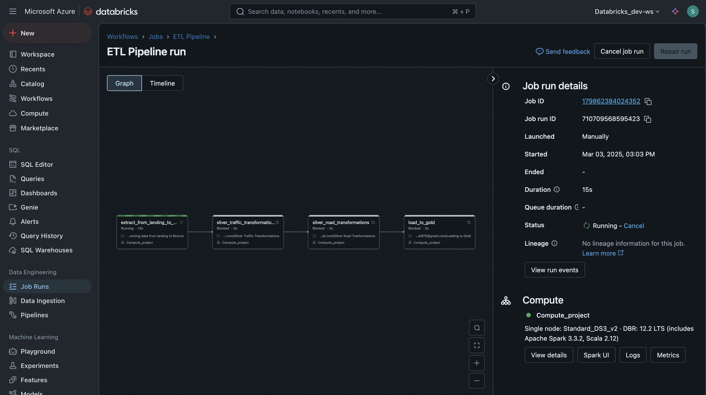
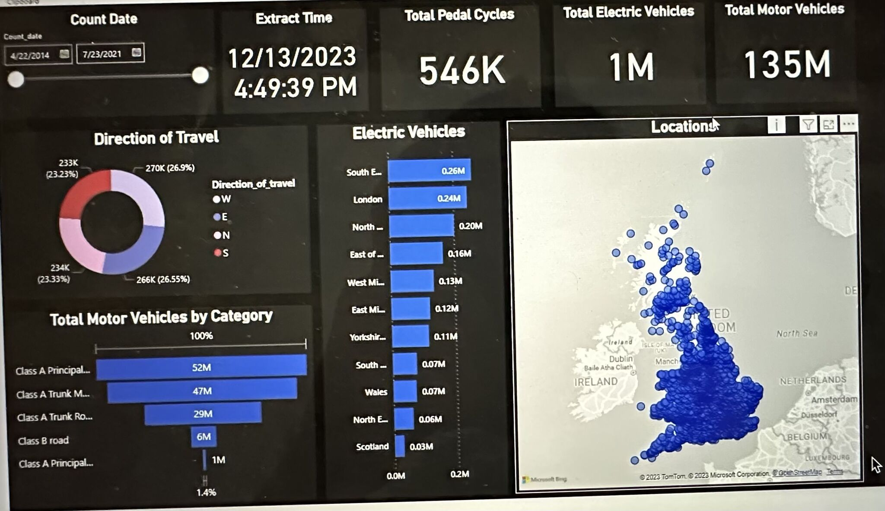
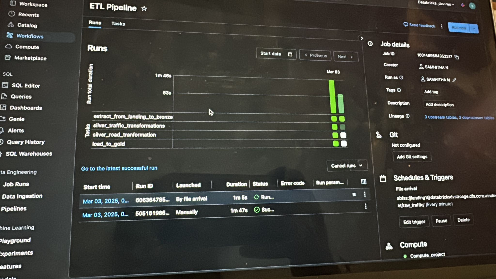

# 🚦 Scalable Data Pipeline for Real-Time Traffic Analytics

This project implements a **modular, scalable data pipeline** to ingest, transform, and analyze real-time traffic data using a **multi-layered architecture** (Bronze → Silver → Gold). It includes orchestration-ready scripts, SQL transformations, and deployment automation for production readiness.

---

## 🏗️ Project Architecture

```
             ┌────────────┐
             │  Raw Data  │
             └────┬───────┘
                  │
        ┌─────────▼─────────┐
        │   Bronze Layer    │  → Initial ingestion
        └─────────┬─────────┘
                  │
        ┌─────────▼─────────┐
        │   Silver Layer    │  → Cleansing & enrichment
        └─────────┬─────────┘
                  │
        ┌─────────▼─────────┐
        │    Gold Layer     │  → Aggregation & analytics
        └───────────────────┘
```

---

## 📁 File Overview

| File Name                            | Description |
|-------------------------------------|-------------|
| `01. Project Setup.py`              | Environment setup and directory initialization |
| `02. Load to bronze.py`             | Ingests raw traffic data into the Bronze layer |
| `03. Silver - Traffic Transformations.py` | Cleans and enriches traffic data |
| `04. Common.py`                     | Utility functions and shared transformations |
| `05. Silver - Roads Transformation.py`  | Preprocessing for road-related records |
| `06. Gold - Final Transformations.py`   | Final aggregation and analytics-ready data output |
| `Playground.sql`, `Test Notebook.sql`   | SQL tests and interactive queries |
| `cicd-main.yml`, `deploy.yml`       | CI/CD pipeline configuration using GitHub Actions |
| `manifest.mf`                       | Manifest file for metadata or environment management |

---

## 🔄 ETL Pipeline Execution (Databricks)

Here is a snapshot of the **ETL pipeline orchestration** running in Databricks:

### 🧭 Pipeline DAG


### 📊 Power BI Dashboard Example


### 📈 Pipeline Monitoring - Job Duration View


---

## 🚀 Setup Instructions

### 1. Clone the repository
```bash
git clone https://github.com/snuka75/Scalable-Data-Pipeline-Development-for-Real-Time-Traffic-Analytics.git
cd Scalable-Data-Pipeline-Development-for-Real-Time-Traffic-Analytics
```

### 2. Install Dependencies
```bash
pip install -r requirements.txt
```

### 3. Run Scripts in Order
```bash
python "01. Project Setup.py"
python "02. Load to bronze.py"
python "03. Silver - Traffic Transformations.py"
python "05. Silver - Roads Transformation.py"
python "06. Gold - Final Transformations.py"
```

---

## ⚙️ Pipeline Layers

### 🔹 Bronze Layer
- Raw ingestion from storage (e.g., Azure Data Lake, AWS S3)
- No transformations; serves as an immutable landing zone

### 🔸 Silver Layer
- Cleaned and enriched data
- Adds fields like: `congestion_level`, `vehicle_type`, `location_zone`
- Filters invalid/missing data

### 🟡 Gold Layer
- Aggregated for reporting and dashboarding
- Supports queries for traffic flow, electric vehicle usage, road categories, etc.

---

## 🛠 Tech Stack

| Tool/Service        | Purpose                                |
|---------------------|----------------------------------------|
| Python              | Core ETL scripting and transformation  |
| PySpark             | Aggregation and validation             |
| Databricks          | Job orchestration and distributed processing |
| Azure DevOps        | CI/CD automation                       |
| Power BI            | Visual reporting & dashboards          |

---

## 📄 License

This project is licensed under the MIT License.

---

## 🙋‍♀️ Author

**Samhitha Nuka**  
*Data Engineer | Cloud & Analytics Enthusiast*

---

## 🔮 Future Enhancements

- Integrate Apache Kafka or Azure Event Hub for streaming data
- Add monitoring with Datadog or Prometheus
- Real-time API endpoints for dashboard alerts

